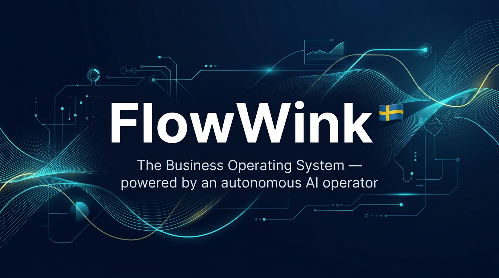

# FlowWink

<p align="center">
  
</p>

> **The Business Operating System — operable by any agent. Ships with one.**
>
> A modular, self-hosted SaaS platform whose every capability is exposed as a skill over **MCP**. Run it with the built-in vertically-integrated operator **FlowPilot**, swap in an external one like **[OpenClaw](https://www.clawable.org)**, mix several in parallel — or run it as a pure SaaS with humans in the loop. The platform doesn't care.

[](LICENSE)
[](https://github.com/magnusfroste/flowwink/releases)

---

## Vision

> **Every business will have an agentic operator. FlowWink is the operating system it runs on — and it lets you bring your own operator.**

## Mission

> **Give every business a self-hosted, fully-featured SaaS platform that any agent can operate via an open protocol — with a great default operator included, and the freedom to swap it out for whatever the agent ecosystem produces next.**

---

## A new kind of business software

For decades, business software has been a collection of tools you operate manually — CMS, CRM, ERP, email, e-commerce — each requiring human input at every step.

**FlowWink is a Business Operating System (BOS):** a unified, modular platform where every module (62 across CMS, CRM, commerce, finance, HR, operations) exposes its capabilities as **agent skills over MCP**. An operator — local or external — turns those skills into autonomous business outcomes.

You set the direction. The operator runs the business. You choose which operator.

---

## The Operator Layer — bring your own brain

```
┌──────────────────────────────────────────────────────────────┐
│  FlowWink SaaS Platform  (always on, agent-agnostic)         │
│  • 62 modules · 280 MCP-exposed skills                      │
│  • Database + RLS · Automations · Event bus · Workflows      │
│  • MCP server — the universal surface for any operator       │
└──────────────────────────────────────────────────────────────┘
                              ▲
                              │   any combination, swap freely
                              │
┌──────────────────────────────────────────────────────────────┐
│  Operators  (opt-in, interchangeable)                        │
│  • FlowPilot      — local, vertically integrated, included   │
│  • OpenClaw       — external, community-driven (clawable)    │
│  • Claude Desktop · Salesforce · Microsoft · Oracle · custom │
└──────────────────────────────────────────────────────────────┘
```

| Profile | Recommended operator |
|---|---|
| SMB, no agent stack, wants "it just works" | **FlowPilot** (built-in) |
| Already runs OpenClaw / Claude Desktop / custom MCP | **External**, FlowPilot off |
| Wants belt-and-braces — local heartbeat + external power | **Both**, on the same skill catalog |
| Pure SaaS, humans in the loop | **Neither** — modules work without an agent |

All four are first-class. Disabling FlowPilot does **not** reduce what FlowWink can do — every skill is still callable over MCP, every automation still fires. See [`docs/concepts/operator-strategy.md`](docs/concepts/operator-strategy.md) and [`docs/architecture/mcp-as-platform.md`](docs/architecture/mcp-as-platform.md).

> **Why this matters:** the rationale for letting traditional SaaS be orchestrated by agents — and the architecture that makes it work — is the subject of the **[Agentic Handbook (clawable)](https://www.clawable.org)**. FlowWink is the reference implementation.

---

## What FlowPilot does

FlowPilot is not a chatbot, a copilot, or a content suggester. It is an **autonomous agent** — a persistent process that wakes up on a configurable schedule (default: every 6 hours), reads your business situation, and acts.

```
┌─────────────────────────────────────────────────────────────────┐
│                     THE AUTONOMOUS LOOP                         │
│                                                                 │
│  Evaluate → Plan → Advance → Propose → Automate → Reflect      │
│      ↑                                                 │        │
│      └─────────── Remember ← ──────────────────────────┘        │
└─────────────────────────────────────────────────────────────────┘
```

| What FlowPilot does | How |
|---------------------|-----|
| Writes and publishes blog posts | Researches topics, drafts, SEO-optimizes, schedules |
| Qualifies and enriches leads | Scores, enriches from domain, routes to deals |
| Sends newsletter campaigns | Segments subscribers, drafts, schedules sends |
| Manages product promotions | Creates landing pages, promotional posts |
| Triages support tickets | Auto-categorizes, routes, resolves from Knowledge Base |
| Reviews deal pipeline | Surfaces stale deals, drafts re-engagement |
| Proposes new objectives | Reads site stats, spots gaps, creates its own goals |
| Federates with peer agents | Delegates tasks to external A2A agents via JSON-RPC |
| Evolves its own capabilities | Creates new skills, updates its instructions, reflects |

---

## Modules — 50+ integrated domains

FlowWink follows an **Odoo-inspired modular architecture** where each module owns its data, views, and skill seeds. Modules register via `defineModule()` with typed contracts.

| Category | Modules |
|----------|---------|
| **Content** | Pages, Blog, Knowledge Base, Docs, Global Blocks, Global Elements, Media Library, Templates, Handbook, Forms, Surveys |
| **CRM & Sales** | Leads, Companies, Deals, Quotes, Sales Intelligence, Customer 360, Company Insights |
| **Commerce** | Products, Orders, POS, Bookings, Subscriptions, Inventory |
| **Finance** | Accounting (BAS 2024 / IFRS / US GAAP), Invoicing, Expenses, Reconciliation, Timesheets |
| **HR & People** | HR, Recruitment, Resume, Contracts, Signature, Calendar |
| **Operations** | Projects, Tasks, Field Service, Manufacturing (MRP-light), Purchasing, SLA, Approvals |
| **Communication** | Email, Newsletter, Webinars, Chat, Workspace Chat |
| **Support** | Tickets (Kanban + auto-triage), Live Support |
| **Growth** | Analytics, Paid Growth, Content Campaigns |
| **System & Operator** | FlowPilot, Federation (A2A + MCP), Browser Control, Composio, Site Migration, Developer, Documents |

Each module provides:
- **Data layer** — Supabase tables + RLS policies + RPCs
- **Admin UI** — React pages under `/admin/`
- **Skill seeds** — capabilities auto-registered into `agent_skills` and exposed over MCP
- **Webhook events** — `module.action` signals on the platform event bus

Composite MCP groups (`marketing`, `sales`, `operations`, …) let an external operator request a curated toolkit with `?groups=marketing` — no need to know the internal taxonomy.

---

## Skills — 280 capabilities, exposed over MCP

| Domain | Sample skills |
|--------|---------------|
| **CMS & Content** | `manage_page`, `manage_blog_post`, `manage_kb_article`, `manage_global_block`, `migrate_url`, `scrape_url` |
| **CRM** | `manage_leads`, `manage_companies`, `manage_deals`, `qualify_lead`, `enrich_company`, `process_signal` |
| **Commerce** | `manage_product`, `place_order`, `record_pos_sale_v2`, `close_pos_session_v2`, `manage_subscription` |
| **Finance** | `manage_journal_entry`, `import_bank_image`, `reconcile_transaction`, `auto_approve_vendor_invoice`, `book_expense`, `mark_paid` |
| **HR & People** | `hire_application`, `auto_allocate_vacation`, `lock_timesheet_period`, `manage_contract`, `manage_employee` |
| **Procure-to-Pay** | `generate_expense`, `submit_expense`, `approve_expense`, `book_expense`, `create_purchase_order`, `receive_goods` |
| **Operations** | `manage_project`, `manage_task`, `manage_field_service`, `sla_check`, `dispatch_automation_event` |
| **Communication** | `send_newsletter_campaign`, `manage_webinar`, `upload_document` |
| **Support** | `triage_ticket`, KB-powered auto-resolve |
| **Intelligence** | `search_web`, `extract_pdf_text`, `competitor_monitor`, `prospect_research` |
| **Operator-internal** *(FlowPilot only, not MCP)* | objectives, soul, reflect, planning, A2A delegation |

All skills follow Anthropic's MCP best practices: self-describing (`Use when:` / `NOT for:`), flat OpenAI-strict-mode-safe JSON Schemas, namespaced. See [`docs/architecture/mcp-overview.md`](docs/architecture/mcp-overview.md).

---

## FlowPilot — the included operator

FlowPilot is FlowWink's **vertically-integrated, local autonomous operator** — one of many possible MCP consumers, but the one that ships in the box. It runs *inside* the platform's trust boundary, which gives it advantages no external operator can replicate: zero-config onboarding, direct DB/event access, brand-aligned defaults, predictable cost.

External operators like **[OpenClaw](https://www.clawable.org)** instead win on velocity, plugin ecosystem and frontier reasoning. FlowWink supports both — see [`docs/concepts/operator-strategy.md`](docs/concepts/operator-strategy.md) for the honest trade-off.

### Heartbeat Protocol (7 steps)

```
1. EVALUATE  — Score past actions against real outcomes (traffic, leads, revenue)
2. PLAN      — Decompose active objectives into executable steps
3. ADVANCE   — Execute the next pending step for each objective
4. PROPOSE   — If no active objectives, analyze stats and create new goals
5. AUTOMATE  — Detect recurring patterns, suggest or create automations
6. REFLECT   — Review recent actions, distill learnings
7. REMEMBER  — Save insights to semantic memory for future cycles
```

### Workflow DAGs — Multi-step automation chains

```
Research topic → Write blog post → Create social posts → Schedule newsletter
     s1               s2                  s3                    s4
                  {{s1.topic}}     {{s2.post_id}}         {{s3.content}}
```

- **Template variables** — `{{stepId.result.field}}` passes data between steps
- **Conditional branching** — run a step only if a previous result meets a condition
- **Failure modes** — `on_failure: continue` or `stop` per step

### Outcome Evaluation Loop

FlowPilot uses **causal correlation** to connect actions to business outcomes:
- Traffic metrics, leads, bookings, and revenue signals
- Hard gates for technical failures (timeout, 429, auth errors)
- Skill Scorecard — flags underperforming skills (>60% negative rate)
- Learnings saved to semantic memory for the next planning cycle

### Multi-Agent Delegation

FlowPilot delegates subtasks to specialist sub-agents with persistent sessions:

```
FlowPilot → delegate_task("seo", "analyze /pricing page")
         → delegate_task("content", "write a case study about...")
         → delegate_task("sales", "review stale deals > $10k")
```

Built-in specialists: **seo**, **content**, **sales**, **analytics**, **email** — each maintains conversation history across invocations.

### Skill Packs

```
skill_pack_install("E-Commerce Pack")        → product_promoter, cart_recovery_check, inventory_report
skill_pack_install("Content Marketing Pack") → content_calendar_view, seo_content_brief, social_post_batch
skill_pack_install("CRM Nurture Pack")       → lead_pipeline_review, deal_stale_check, customer_health_digest
```

---

## Federation — MCP + A2A

FlowWink speaks two open protocols so any operator can connect:

- **MCP (Model Context Protocol)** — the primary surface. 280 skills exposed as tools, resources like `flowwink://briefing`, group filtering via `?groups=marketing`. Works with Claude Desktop, OpenClaw, custom MCP clients.
- **A2A (Agent-to-Agent JSON-RPC 2.0)** — peer-to-peer delegation between agents.

```
┌─────────────┐   MCP / A2A    ┌────────────────────┐
│  FlowWink   │◄──────────────▶│  Operator           │
│  Platform   │   tools/call   │  • FlowPilot (local)│
│ (modules +  │   resources    │  • OpenClaw         │
│  280 skills)│   message/send │  • Claude Desktop   │
└─────────────┘                │  • custom           │
                                └────────────────────┘
```

- **Directional connections** — peers can be inbound (MCP), outbound (`/v1/responses`) or bidirectional (A2A)
- **Graceful degradation** — 503 `peer_unavailable` handling when peers are offline
- **Audit loop** — architectural findings from peers auto-convert to platform objectives
- **Agent Card** — `/.well-known/agent.json` discovery endpoint

---

## Architecture

FlowWink follows the **OpenClaw** agentic architecture — composable layers with clear separation of concerns:

```
┌─────────────────┐     ┌──────────────────┐     ┌─────────────────┐
│   Gateway        │     │   Brain           │     │   Memory         │
│                  │     │                   │     │                  │
│ • Visitor chat  │────▶│ • Pilot engine    │────▶│ • pgvector       │
│ • Admin operate │     │   (ReAct loop)    │     │   semantic search│
│ • Webhooks      │     │ • resolveAiConfig │     │ • Soul + Identity│
│ • Heartbeat     │     │ • tool execution  │     │ • Conversation   │
│ • A2A ingest    │     │ • trace IDs       │     │ • Objectives     │
└─────────────────┘     └──────┬───────────┘     └─────────────────┘
                               │
              ┌────────────────┼────────────────────┐
              │                │                    │
       ┌──────▼─────┐  ┌───────▼───────┐  ┌────────▼──────┐
       │   Skills    │  │   Heartbeat   │  │   Workflows   │
       │             │  │               │  │               │
       │ 60+ skills  │  │ 7-step loop   │  │ DAG chains    │
       │ Skill Packs │  │ Self-healing  │  │ Conditions    │
       │ A2A peers   │  │ Outcome eval  │  │ Template vars │
       └─────────────┘  └───────────────┘  └───────────────┘
```

### One reasoning core, all surfaces

The Pilot engine (`_shared/pilot/`) is the single engine shared by every surface:
- **`agent-operate`** — interactive admin sessions (streaming)
- **`flowpilot-heartbeat`** — autonomous scheduled loop
- **`chat-completion`** — visitor-facing AI chat
- **`a2a-ingest`** — incoming federation requests

No logic duplication. All surfaces get every capability automatically.

### Modularized core

```
_shared/
├── pilot/
│   ├── reason.ts          — Main ReAct reasoning loop
│   ├── prompt-compiler.ts — System prompt assembly
│   ├── handlers.ts        — Built-in tool implementations
│   └── built-in-tools.ts  — Tool definitions
├── types.ts               — Shared type definitions
├── ai-config.ts           — Provider routing (OpenAI → Gemini → Local)
├── concurrency.ts         — Lane-based locking
├── token-tracking.ts      — Budget management
├── trace.ts               — Correlation IDs (fp_{ts}_{rand})
└── domains/
    └── cms-context.ts     — CMS domain pack
```

### Provider-agnostic, self-hosted first

```
OpenAI GPT-4o → Gemini 2.5 Flash → Local LLM (Ollama / LM Studio / vLLM)
```

FlowPilot routes to whichever provider is configured. Use your own API keys. Run fully offline with a local model. No vendor lock-in.

---

## What FlowWink replaces

FlowWink draws inspiration from the best-in-class platforms across every business domain — and unifies them under one autonomous operator.

| Category | Platforms that inspired | FlowWink's BOS module |
|----------|----------------------|----------------------|
| **Website** | WordPress, Webflow, Squarespace, Weebly | Visual block editor, 50+ blocks, headless API |
| **CRM & Sales** | HubSpot, Pipedrive, Salesforce | Leads, deals, companies — AI-qualified and enriched |
| **Email & Marketing** | Mailchimp, Klaviyo, ConvertKit | Newsletter with autonomous segmentation and campaigns |
| **Booking** | Calendly, Acuity | Service bookings with AI follow-up |
| **Support** | Zendesk, Freshdesk, Intercom | Tickets + live chat with AI triage from Knowledge Base |
| **Content & Copy** | Jasper, Copy.ai, Surfer SEO | FlowPilot writes, optimizes, and publishes into CMS |
| **Automation** | Zapier, n8n, Make | Workflow DAGs with conditional branching |
| **E-Commerce** | Shopify, WooCommerce | Products, orders, inventory, Stripe checkout |
| **Finance** | QuickBooks, Xero, FreshBooks | Invoicing, double-entry accounting, expenses |
| **Time Tracking** | Toggl, Harvest, Clockify | Timesheets with project-based tracking |
| **ERP** | Odoo, ERPNext | Modular architecture — 37 domains, one platform |
| **Headless CMS** | Contentful, Storyblok, Strapi | REST + GraphQL content API, multi-channel delivery |

**The difference:** those platforms give you tools. FlowWink gives you an operator that *uses* the tools.

One operating system. One operator. Self-host free.

---

## Tech Stack

| Layer | Technology |
|-------|------------|
| Frontend | React 18, Vite, TypeScript, Tailwind CSS |
| UI Components | shadcn/ui, Radix UI |
| Backend | Supabase (PostgreSQL + pgvector, Auth, Storage, Edge Functions) |
| Agent Engine | Deno edge functions, OpenAI function-calling format |
| Editor | Tiptap |
| State | TanStack Query |
| AI Providers | OpenAI, Google Gemini, Local LLM (Ollama / LM Studio / vLLM) |
| Federation | A2A JSON-RPC 2.0 protocol |

---

## Self-Hosting

FlowWink is **free to self-host**. Your agent, your data, your infrastructure.

### Quick Start

```bash
git clone https://github.com/magnusfroste/flowwink.git
cd flowwink
npm install
cp .env.example .env
# Edit .env with your Supabase credentials
npm run dev   # migrations run automatically
```

### Connect your Supabase instance

1. Create a project at [supabase.com](https://supabase.com/)
2. Copy **Project URL**, **Anon key**, and **Project ref** into `.env`
3. Run `npm run cli` and use `/install` to deploy functions, run migrations and create admin
4. Start the server — migrations apply automatically on `npm run dev`

### Deploy to production

The recommended FlowWink stack:

- **Backend** — [Supabase Cloud](https://supabase.com/) (free tier works for getting started). Holds the database, auth, edge functions and storage.
- **Frontend** — deploy this repo to [Vercel](https://vercel.com/), Netlify, Cloudflare Pages, or any static host. Vercel auto-deploys on every push to `main`.

```bash
# Push database schema + edge functions to your Supabase project
supabase link --project-ref <your-ref>
supabase db push
supabase functions deploy --project-ref <your-ref>
```

Then point your Vercel project at this repo and set the three env vars (`VITE_SUPABASE_URL`, `VITE_SUPABASE_PUBLISHABLE_KEY`, `VITE_SUPABASE_PROJECT_ID`). That's it.

See **[docs/guides/deployment.md](docs/guides/deployment.md)** for the full walkthrough.

---

## Documentation

Start at **[docs/start-here.md](docs/start-here.md)** — the curated entry point that routes to operators, builders, agents and reference material.

| Document | What it covers |
|----------|---------------|
| **[docs/modules/flowpilot.md](docs/modules/flowpilot.md)** | FlowPilot agent reference — skills, heartbeat, tools |
| **[docs/reference/skills-source.md](docs/reference/skills-source.md)** | Skill registry — all registered skills |
| **[docs/reference/module-api.md](docs/reference/module-api.md)** | Module contract system, typed schemas, plugin architecture |
| **[docs/concepts/openclaw-law.md](docs/concepts/openclaw-law.md)** | Agentic architecture laws |
| **[docs/concepts/prd.md](docs/concepts/prd.md)** | Product requirements — modules, capabilities |
| **[docs/concepts/elevator-pitch.md](docs/concepts/elevator-pitch.md)** | BOS positioning, vision, competitive landscape |
| **[docs/guides/setup.md](docs/guides/setup.md)** | Supabase setup, environment variables, migrations |
| **[docs/guides/deployment.md](docs/guides/deployment.md)** | Supabase Cloud + Vercel deployment walkthrough |
| **[docs/builders/README.md](docs/builders/README.md)** | Architecture, extending the platform, writing skills |
| **[docs/guides/security.md](docs/guides/security.md)** | RLS policies, auth patterns, security model |
| **[docs/contributing/test-suite.md](docs/contributing/test-suite.md)** | Autonomous test framework (L1–L8) |
| **[docs/concepts/a2a-communication-model.md](docs/concepts/a2a-communication-model.md)** | Agent-to-Agent federation protocol |
| **[docs/pilot/](docs/pilot/)** | Pilot engine internals — architecture, handlers, reasoning |

---

## Roadmap

- **Hosted Skill Pack Registry** — Import community skill packs from a manifest URL
- **Workflow Visualization** — Admin UI to view and edit DAG steps visually
- **Multi-Tenant Mode** — Run FlowWink as a SaaS with per-tenant agent isolation
- **Agent Marketplace** — Shareable FlowPilot configurations (soul + skills + workflows)
- **Expanded A2A Ecosystem** — Peer discovery, trust scoring, capability negotiation

---

## Contributing

Contributions are welcome. Open an issue or submit a pull request. See **[docs/contributing/contributing.md](docs/contributing/contributing.md)**.

## Learn More — The Agentic Handbook

FlowWink is the reference implementation of a thesis: **traditional SaaS becomes radically more valuable when it's operable by agents over an open protocol**. The handbook explains why, how, and what patterns hold up in production.

📖 **[clawable — The Agentic Handbook & OpenClaw](https://www.clawable.org)** — Practical guide to building agentic systems, the OpenClaw operator, and the architectural laws FlowWink follows.

Cross-references inside this repo:
- [`docs/concepts/operator-strategy.md`](docs/concepts/operator-strategy.md) — Why FlowPilot is a *module*, not the core
- [`docs/architecture/mcp-as-platform.md`](docs/architecture/mcp-as-platform.md) — The rule that keeps modules + MCP independent of any operator
- [`docs/architecture/mcp-overview.md`](docs/architecture/mcp-overview.md) — MCP endpoints, auth, schemas, group filtering
- [`docs/concepts/openclaw-law.md`](docs/concepts/openclaw-law.md) — The 10 inviolable agentic architecture laws

## License

MIT — see [LICENSE](LICENSE) for details.

---

*Stop managing tools. Start directing outcomes. Bring your own operator — or use the one in the box.*

**Made in Sweden 🇸🇪**
