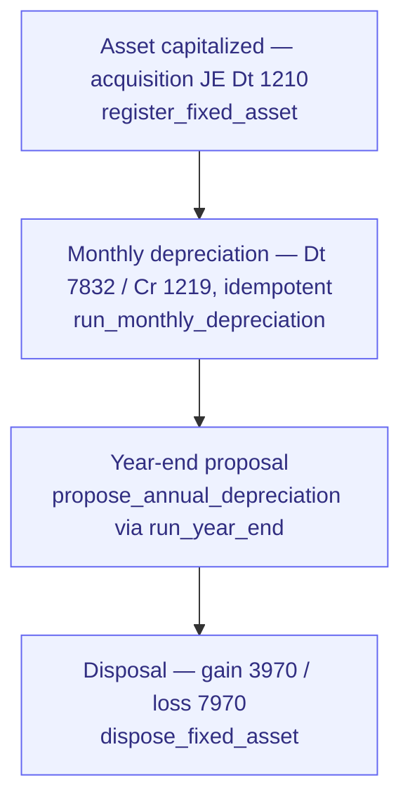

# Acquire-to-Retire

> Fixed-asset lifecycle: capitalize → depreciate monthly → (impair/adjust) → dispose
> with gain/loss. The asset mirror of Record-to-Report.

**Problem it solves:** Fixed assets live in a depreciation spreadsheet the auditor asks about once a year — this process books acquisition, monthly depreciation and disposal gain/loss automatically, always in balance with the ledger.

**Maturity level:** L3 — Operational
**Status:** ✅ Live (engine shipped pre-program; formalized as a process 2026-06-12)

## Flow

*🟦 = agent-runnable step (see Agent coverage below)*

## Participating modules & skills

| Step | Module | Skills |
|---|---|---|
| Acquire | fixed-assets + accounting | `register_fixed_asset` (alias-tolerant for external agents — accepts `acquisition_cost_cents`/`useful_life_years` as well as the canonical `cost_cents`/`useful_life_months`; hardened 2026-07-08 per OpenClaw finding) |
| Depreciate | fixed-assets | `run_monthly_depreciation` (straight-line/declining) |
| Year-end | fixed-assets + accounting | `propose_annual_depreciation`, `run_year_end` |
| Retire | fixed-assets | `dispose_fixed_asset` |

## Agent coverage

| Actor | What they run |
|---|---|
| 👤 Manual | Fixed assets admin, journal review |
| 🤖 FlowPilot | monthly depreciation runs, year-end proposals |
| 🔗 External agent | full lifecycle over MCP |

## Known gaps (parity scorecards)

Impairment/revaluation, IFRS 16 leases, component tracking, schedule report —
see `docs/parity/capabilities/fixed-assets.json`.
