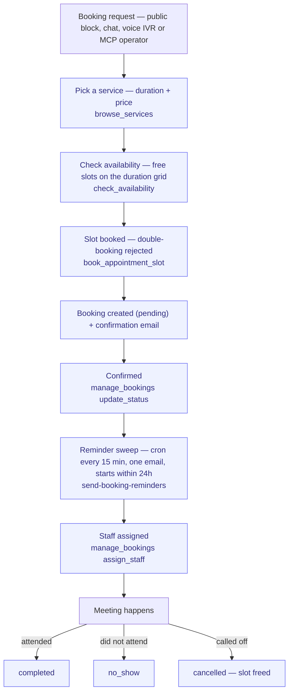

# Book-to-Meet

> From "I'd like an appointment" to a completed meeting: check availability,
> book a slot, confirm, remind, staff it, and record the outcome.

**Problem it solves:** Appointments live in phone tag — double bookings, forgotten reminders, no-shows nobody recorded — this process books overlap-safe slots around the clock (web, chat or phone), then confirms and reminds by itself.

**Maturity level:** L3 — Operational (agent-run booking path Stage-3-verified live 2026-07-04)
**Status:** ✅ Happy path + overlap-protected agent booking live · reminder sweep, staff assignment and no-show tracking shipped 2026-07-03 (code-complete, not yet fleet-verified)

---

## Modules involved

| Module | Role in the process |
|--------|---------------------|
| **Booking** | Services, availability windows, blocked dates, the bookings themselves |
| **Email** | Confirmation on booking (`send-booking-confirmation`) and the 24h reminder sweep (`send-booking-reminders` → `email-send`) |
| **Voice** | Phone intake — booking IVR (UC4): caller picks a slot, callback scheduling pairs with the booking |
| **Calendar** | Read-only aggregation — bookings appear in the unified `list_events` calendar |
| **SLA** | Booking-confirmation monitors (`sla_check` / `manage_sla_policy` with `entity_type: booking`) |
| **HR (Employees)** | Staff assignment target — `bookings.assigned_employee_id` references `employees` |

---

## Step-by-step flow

*🟦 = agent-runnable step (see Agent coverage below)*

---

## How it works in practice

*The adopter lens (see [README](./README.md) § The adopter layer). This is the
canonical home for the booking state machine — module docs link here and never
restate it.*

### The work story

A visitor opens the booking block (or calls in — the voice IVR runs the same
skills) and picks a service. The agent or block asks `check_availability` for
the day and gets back ready-to-offer `free_slots`, already on the service's
duration grid with existing bookings, blocked dates and past times removed.
The visitor picks 10:00; `book_appointment_slot` derives the end time from the
service's `duration_minutes` and refuses the slot if anyone else grabbed it in
between (`slot_unavailable` — the agent re-checks and offers the next slot).
The booking lands as **pending** and the customer gets a confirmation email.
Staff confirms it (or an agent does), which arms the reminder: a cron sweep
every 15 minutes finds confirmed bookings starting within 24 hours that were
never reminded, emails the customer once, and stamps `reminder_sent_at`.
Someone assigns the appointment to an employee, the meeting happens, and the
booking ends as **completed** — or **no_show** if the customer never turned
up, or **cancelled**, which frees the slot immediately.

### State machine

**`bookings.status`** (CHECK constraint: `pending / confirmed / cancelled /
completed / no_show` — `no_show` added by migration `20260703151000`)

| Status | Meaning | Moved forward by | What the transition does |
|---|---|---|---|
| `pending` | Requested, awaiting confirmation | visitor (public block), agent (`book_appointment_slot`, `book_appointment`) | Row created; end time derived from service duration; overlap with any non-cancelled booking of the same service rejected (`slot_unavailable`); public-block path invokes `send-booking-confirmation` and fires `booking.submitted` |
| `confirmed` | Slot is committed | admin / agent (`manage_bookings` `update_status`) | Makes the booking eligible for the reminder sweep (`send-booking-reminders`: starts <24h + `reminder_sent_at IS NULL` → one email, then stamped) and for SLA confirmation monitoring |
| `completed` | Meeting happened | admin / agent (`update_status`) | Terminal bookkeeping — no side effects |
| `no_show` | Confirmed but customer did not attend | admin / agent (`update_status`, only meaningful for past confirmed bookings — UI gates on `start_time` in the past) | Terminal; keeps the no-show on record for the customer history |
| `cancelled` | Called off | admin / agent (`manage_bookings` `cancel` or `update_status`) | Stamps `cancelled_at` (+ optional `cancelled_reason`); the slot is freed immediately — overlap checks exclude cancelled bookings |

There is no reschedule transition: reschedule = `cancel` + new
`book_appointment_slot` (documented in the skill instructions).

### Who does what

See the Agent coverage table below — the whole intake loop (services →
availability → overlap-safe booking → find-my-booking by email/phone) is
agent-runnable and was verified live over the MCP gateway; confirm, staff
assignment, no-show and cancellation run through `manage_bookings`
(internal scope).

### Coming from spreadsheets

- The phone-and-paper appointment book → services + availability windows set once (`manage_booking_availability`), slots computed for you
- The mental "is that slot taken?" check → `book_appointment_slot` rejects double-bookings at the database level
- The morning "don't forget your appointment" call round → the 15-minute cron sweep, one reminder per booking, never re-sent
- The whiteboard "who takes this one?" → `assigned_employee_id` on the booking
- The crossed-out row in the book → `cancelled` with timestamp + reason, slot instantly reusable

---

## Agent coverage

| Step | 👤 Manual | 🤖 FlowPilot | 🔗 External agent |
|------|----------|-------------|-------------------|
| Service setup | ✅ (BookingServicesTab) | ✅ (`manage_booking_availability`) | — |
| Availability check | — | ✅ (`check_availability` — free_slots) | ✅ Stage-3 verified 2026-07-04 |
| Booking | ✅ (public block, CreateBookingDialog) | ✅ (`book_appointment_slot`, legacy `book_appointment`) | ✅ Stage-3 verified 2026-07-04 (overlap rejection incl.) |
| Confirmation email | — | auto (`send-booking-confirmation` on public-block booking) | — |
| Confirm / status | ✅ | ✅ (`manage_bookings` `update_status`) | ✅ |
| Reminder | — | auto (`booking-reminders` cron → `send-booking-reminders`) | — |
| Staff assignment | ✅ (BookingsPage) | ✅ (`manage_bookings` `assign_staff`) | ✅ |
| No-show / complete | ✅ | ✅ (`update_status`) | ✅ |
| Voice intake | — | ✅ (booking IVR runs the same skills) | — |

---

## Known gaps (missing for L4/L5)

- ⚠️ Reminder sweep, staff assignment and no-show shipped 2026-07-03 — code-complete + cron-registered, not yet live-fleet-verified
- ❌ Per-resource/staff calendars (availability is per service, not per employee)
- ❌ Multi-resource capacity / overbooking control
- ❌ Waiting list for full slots
- ❌ Buffer time between appointments
- ❌ Video-link generation and pre-booking intake forms
- Voice IVR entry is L1 (unscored) — works through the shared skills, no dedicated scorecard yet

---

## Webhook events

`booking.submitted`, `booking.confirmed`, `booking.cancelled`

---

## Best for

Consultants, clinics, salons, agencies — any SMB whose "first process" is
getting appointments booked without phone tag.

## Not for

Multi-room/multi-resource scheduling (class bookings, equipment rental) or
per-staff calendars — capacity and resource modeling are not there yet.
