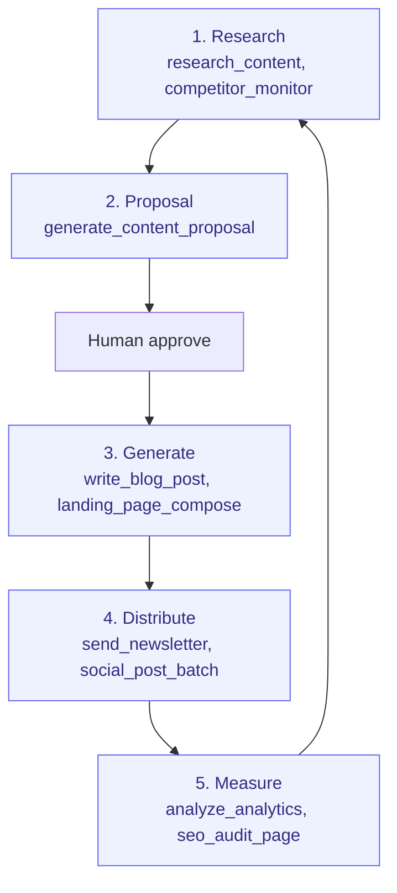

# Content-to-Conversion

> From idea to published article to measurable outcome. FlowWink's "agent-shines" process.

**Problem it solves:** Content marketing dies of "no time to write" — research, drafting, distribution and measurement each need hours nobody has — this process lets the agent run the whole pipeline while a human only approves the ideas.

**Maturity level:** L4 — Agent-augmented
**Status:** ✅ FlowPilot's strongest autonomous flow

---

## Modules involved

| Module | Role in the process |
|--------|---------------------|
| **Pages** | Landing pages (block-based) |
| **Blog** | Articles, categories, tags |
| **Knowledge Base** | Self-service support articles |
| **Newsletter** | Distribution to subscribers |
| **Paid Growth** | Ad campaigns to amplify reach |
| **Analytics** | Tracking traffic, conversion, SEO |
| **Sales Intelligence** | Competitor and topic research |

---

## Step-by-step flow (Content Pipeline — 5 steps)

*🟦 = agent-runnable step (see Agent coverage below)*

---

## Agent coverage

| Step | 👤 Manual | 🤖 FlowPilot | 🔗 External agent |
|------|----------|-------------|-------------------|
| Competitor research | ✅ | ✅ (`competitor_monitor`, `research_content`) | 🔗 Delegation possible |
| Content brief | ✅ | ✅ (`seo_content_brief`) | — |
| Proposal generation | — | ✅ (`generate_content_proposal`) | 🔗 Audit via peer |
| Article writing | ✅ | ✅ (`write_blog_post`) | 🔗 Review via peer |
| Landing page composition | ✅ | ✅ (`landing_page_compose`) | — |
| Social posts | ✅ | ✅ (`social_post_batch`, `generate_social_post`) | — |
| Newsletter sends | ✅ | ✅ (`send_newsletter`) | — |
| Ad creative | ✅ | ✅ (`ad_creative_generate`) | — |
| Performance analysis | ✅ | ✅ (`analyze_analytics`, `ad_performance_check`) | — |
| KB gap analysis | — | ✅ (`kb_gap_analysis`) | — |

---

## Known gaps (missing for L5)

- ❌ A/B testing of headlines/CTAs (infrastructure missing)
- ❌ Multi-language content management
- ❌ Editorial calendar with deadlines / approvals
- ❌ Influencer / partnership outreach
- ⚠️ Image generation requires external AI (OpenAI / Gemini / local)

---

## Webhook events

`blog.published`, `newsletter.sent`

---

## Best for

Inbound-marketing-driven SMBs. Consultancies, SaaS startups, B2B services where content is the primary lead source.

## Not for

Brand-heavy D2C labels needing Figma-driven design + complex DAM, or PR-heavy organizations.
