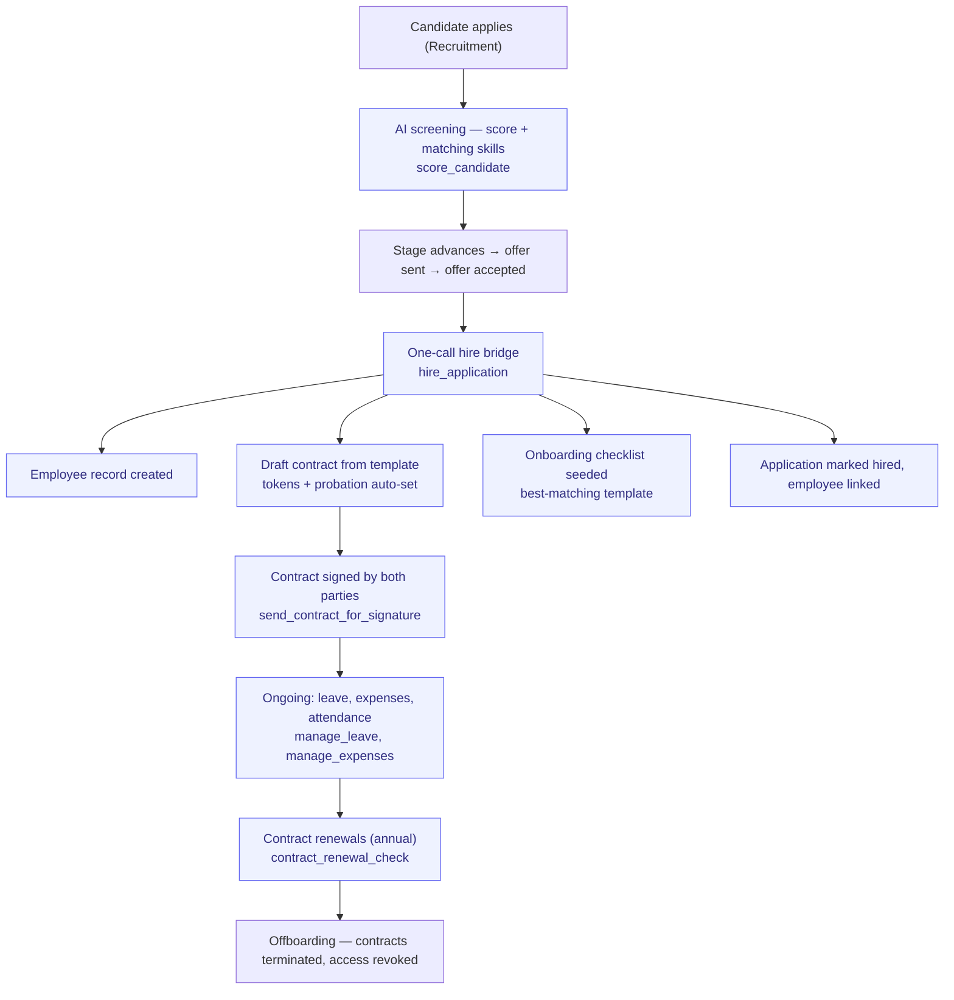

# Hire-to-Retire

> The full employee lifecycle — from hire to offboarding.

**Problem it solves:** A new hire means re-typing the same person into five places — contract, checklist, HR record, all by hand — this process turns an accepted offer into employee record, draft contract and onboarding checklist in one call, and keeps leave and expenses tidy afterwards.

**Maturity level:** L3 — Operational (auto-hire bridge live; payroll internal cycle live; performance still manual)
**Status:** ✅ Hire-to-Onboard automated; ✅ payroll runs live (`create_payroll_run`→`approve_payroll_run`→`mark_payroll_paid`, `generate_agi_export`, `year_end_payroll_summary`); ⚠️ statutory filing (AGI/Skatteverket submit) still external; ⚠️ lacks performance management

---

## Modules involved

| Module | Role in the process |
|--------|---------------------|
| **Recruitment** | Job postings, applications, AI scoring, hire bridge (`hire_application`) |
| **HR** | Employee records, leave handling, onboarding checklists, vacation auto-allocation |
| **Contracts** | Employment agreements, lifecycle, renewal checks |
| **Documents** | HR documents (contracts, certificates, policies) |
| **Expenses** | Employee expense claims (full P2P loop: submit → approve → book → pay) |
| **Resume** | Consultant profiles / talent matching |

---

## Step-by-step flow

*🟦 = agent-runnable step (see Agent coverage below)*

---

## Agent coverage

| Step | 👤 Manual | 🤖 FlowPilot | 🔗 External agent |
|------|----------|-------------|-------------------|
| Candidate screening | ✅ | ✅ (`score_candidate`) | — |
| **Hire bridge (app→emp+contract+onboarding)** | ✅ | ✅ (`hire_application`) | ✅ MCP-exposed |
| Employee registration | ✅ | ✅ (`manage_employee`) | — |
| Contract handling | ✅ | ✅ (`manage_contract`, `send_contract_for_signature`) | — |
| Onboarding checklist | ✅ | ✅ (`onboarding_checklist`) | — |
| Leave requests | ✅ | ✅ (`manage_leave`) | — |
| **Year-end vacation allocation** | ✅ | ✅ (`auto_allocate_vacation`) | ✅ MCP-exposed |
| Contract renewal check | — | ✅ (`contract_renewal_check`) | — |
| Performance reviews | ❌ Missing | — | — |
| Payroll runs | ✅ | ✅ (`create_payroll_run` → `approve_payroll_run` → `mark_payroll_paid`; `calc_sick_pay`, `apply_pension`, `list_payroll_lines`) | ✅ (admin functions, service-role verified) |

---

## Known gaps (missing for L3+)

- ✅ **Payroll runs** — the `payroll` module runs the internal cycle
  (create → approve → mark paid, with sick-pay calculation and pension
  application per line). What is still missing is the **statutory tail**:
  AGI/employer declarations to Skatteverket, payslip distribution, and
  export/integration to Fortnox Lön / Visma / Hogia for firms that file there
- ❌ Performance management / PDP / 1:1 notes
- ❌ Compensation planning
- ✅ Time-off accrual: `auto_allocate_vacation` matches `vacation_policies` (age/tenure) + capped carry-over, audit-logged per employee
- ❌ Org chart / reporting structure
- ❌ Employment contract templates with Swedish collective agreements

---

## Webhook events

`employee.created`, `leave.requested`, `leave.status_changed`, `contract.created`, `contract.signed`, `contract.status_changed`, `expense.submitted`

---

## Best for

Smaller consultancies (< 30 employees) wanting simple HR data + document archive in one place.

## Not for

Companies that need a full HRIS with payroll, performance management, or collective-agreement logic. Pair with Fortnox/Visma for payroll.
