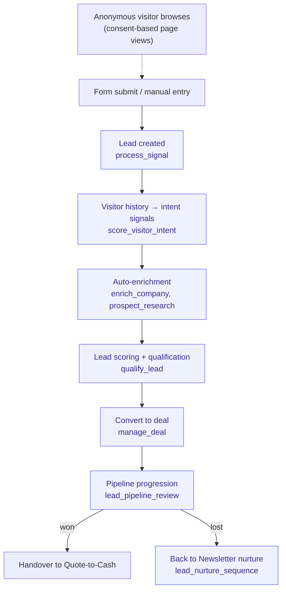

# Lead-to-Customer

> From first touch to closed-won. The full top-of-funnel + CRM pipeline.

**Problem it solves:** Inbound leads land in an inbox, get answered days later, and nobody remembers who was promised what — this process captures, enriches, scores and follows up every lead within minutes, automatically.

**Maturity level:** L4 — Agent-augmented
**Status:** ✅ Production-ready for SMB

---

## Modules involved

| Module | Role in the process |
|--------|---------------------|
| **Forms** | Captures inbound leads from web forms |
| **Visitor Intelligence** | Consent-based page-view tracking of anonymous visitors; when a visitor identifies (form/chat), their browsing history becomes scoring signals |
| **Leads** | Lead records, scoring, pipeline stages |
| **Companies** | B2B company registry with firmographic data |
| **Sales Intelligence** | Prospect research, enrichment, fit analysis |
| **Deals** | Sales pipeline with stages (qualified → won/lost) |
| **Newsletter** | Nurture sequences for leads not yet sales-ready |

---

## Step-by-step flow

*🟦 = agent-runnable step (see Agent coverage below)*

---

## Agent coverage

| Step | 👤 Manual | 🤖 FlowPilot | 🔗 External agent |
|------|----------|-------------|-------------------|
| Form capture | ✅ | ✅ (`process_signal`) | — |
| Visitor intent scoring | — | ✅ (`score_visitor_intent` — auto: DB trigger on lead identify + 15-min cron; `get_visitor_timeline` for the per-lead journey) | — |
| Enrichment | ✅ | ✅ (`enrich_company`, `prospect_research`) | ✅ via A2A |
| Lead scoring | ✅ | ✅ (`qualify_lead`) | — |
| Pipeline review | ✅ | ✅ (`lead_pipeline_review`) | — |
| Nurture sequencing | ✅ | ✅ (`lead_nurture_sequence`) | — |
| Deal conversion | ✅ | ✅ (`manage_deal`) | — |
| Stale deal detection | — | ✅ (`deal_stale_check`) | — |

---

## Known gaps (missing for L5)

- ❌ Multi-touch attribution (which channel closed the deal?)
- ❌ Forecasting / pipeline projection
- ❌ Duplicate handling on lead merge is basic
- ❌ Round-robin lead assignment to reps

---

## Webhook events

`form.submitted`, `lead.created`, `lead.score_updated`, `lead.status_changed`, `deal.won`, `deal.lost`

---

## Best for

SMBs with inbound + light outbound. Consultancies, B2B services, agencies.

## Not for

Enterprise with complex approval workflows, or pure outbound SDR organizations needing dialer/sequencer features.
