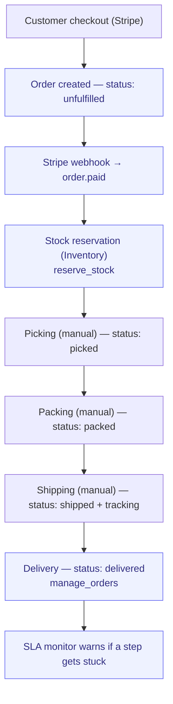

# Order-to-Delivery

> From customer order to delivered product. The core e-commerce flow.

**Problem it solves:** Orders arrive faster than the back office can track them — paid-but-never-picked slips through and stock counts drift — this process keeps every order's status honest from checkout to doorstep and warns when a step gets stuck.

**Maturity level:** L3 — Operational
**Status:** ✅ Happy path works; SLA monitor covers manual steps

---

## Modules involved

| Module | Role in the process |
|--------|---------------------|
| **Products** | Order records (`manage_orders`, `place_order`, `lookup_order`), catalog, pricing, cart recovery |
| **Inventory** | Stock reservation, picking (`allocate_picking`/`confirm_pick`/`ship_picking`), adjustments |
| **POS** | In-store sales channel that emits `stock.movement` events into the same fulfillment pipe |
| **SLA** | Monitors that manual steps happen on time |
| **Documents** | Delivery notes, shipping labels |
| **Newsletter** | Order confirmations, delivery notifications |

---

## Step-by-step flow

*🟦 = agent-runnable step (see Agent coverage below)*

---

## Agent coverage

| Step | 👤 Manual | 🤖 FlowPilot | 🔗 External agent |
|------|----------|-------------|-------------------|
| Order intake | — | ✅ Auto (Stripe webhook) | — |
| Stock check / reservation | ✅ | ✅ (`manage_inventory`, `reserve_stock`) | — |
| Cart recovery | — | ✅ (`cart_recovery_check`) | — |
| Pick/pack/ship | ✅ | ✅ (`allocate_picking`, `confirm_pick`, `ship_picking`) | ✅ over MCP |
| Partial fulfillment | ✅ (OrderLineFulfillment) | ✅ (`fulfill_order_line` — order ships when all lines complete) | — |
| Order status updates | ✅ | ✅ (`manage_orders`) | — |
| Customer notifications | ✅ | ✅ (Newsletter automation) | — |
| SLA escalation | — | ✅ (SLA module) | — |

---

## Known gaps (missing for L5)

- ✅ Returns / RMA — full reverse flow lives in [Return-to-Refund](./return-to-refund.md) (request → approve → receive → inspect → partial refund)
- ✅ Partial shipments — `order_items.qty_fulfilled` + `fulfill_order_line`; ships only when all lines complete
- ✅ Cycle counting — `manage_inventory_count` (skill + admin UI, Stage-3 verified 2026-07-06)
- ❌ Integrations with WMS / carriers (Postnord, DHL APIs) — the `shipping` module tracks shipments but has no carrier API adapters
- ❌ Multi-warehouse fulfillment routing
- ❌ Pre-orders / backorder auto-creation on stockout (partly via `back_in_stock_requests`)
- ❌ Picklists / pack-station UI (skills exist; warehouse-floor UI does not)

---

## Webhook events

`order.created`, `order.paid`, `order.fulfilled`, `stock.low`, `stock.adjusted`

---

## Best for

D2C / e-commerce with physical products, moderate volume (< 1000 orders/day), self-fulfillment or simple 3PL.

## Not for

Marketplaces with many sellers, or highly automated fulfillment centers (require WMS).
