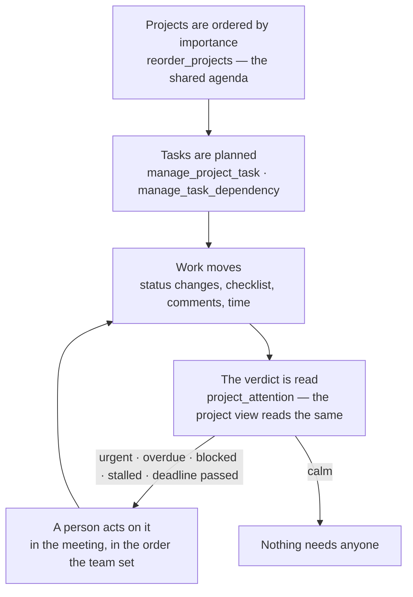

# Plan-to-Deliver

> From a list of projects to the question every status meeting starts with: *what needs someone now?*

**Problem it solves:** A team runs many workstreams at once — finance, legal, production, a listing — and the work that is really stuck is rarely the work that is late. It is waiting on something unfinished, it was marked urgent, or it has sat in progress with nobody touching it. A list sorted by creation date shows none of that.

**Maturity level:** L3 — Agent-readable
**Status:** ✅ Projects, tasks, dependencies and milestones; one verdict of what needs attention, shared by the project view and the agent's brief; a shared team order that is the meeting's agenda

---

## Modules involved

| Module | Role in the process |
|--------|---------------------|
| **Projects** | Projects, tasks, dependencies, milestones, the team order |
| **Timesheets** | Time entries count as movement on a task |
| **FlowPilot** | Reads the portfolio brief, writes steps and questions on tasks |

---

## Step-by-step flow

---

## What "needs attention" means

One rule, in the database (`project_attention_verdict`), read by both the project view and the agent's `project_portfolio_brief`:

| Signal | Means |
|---|---|
| **urgent** | an open task with priority *urgent* — the team has said it blocks |
| **overdue** | an open task past its due date, in the **platform's own day**, not the server's UTC day |
| **blocked** | an open task with an unfinished prerequisite |
| **stalled** | in progress with no *movement* for 5 days — a status change, a ticked checklist item, a person's comment or a time entry. An agent's own comment never counts, or the sensor would silence itself by asking |
| **deadline passed** | the project's own deadline is behind it and work is still open |

A task without a due date is never overdue — which is not the same as fine. A team that does not set dates shows its trouble as blocked, urgent or stalled instead, and the verdict sees it.

Projects that need attention are ordered by weight (urgent ×4, overdue ×3, blocked ×2, stalled ×1, deadline +3), and among equals by the team order.

## The team order and the sort

Two different things:

- **The team order** is shared data — it is the agenda, everyone sees the same, and it is changed by dragging in the project view or by `reorder_projects`. A new project lands on top.
- **The sort** is the viewer's own: team order, needs attention first, recently active, name or newest. It is remembered per viewer and never written to the database, so one person's sort cannot flip the list for everyone.

*Recently active* uses the same definition of movement as *stalled*.

---

## Agent coverage

| Step | 👤 Manual | 🤖 FlowPilot | 🔗 External agent |
|------|----------|-------------|-------------------|
| Order projects | ✅ drag in the rail | ✅ (`reorder_projects`) | ✅ |
| Plan tasks and dependencies | ✅ | ✅ (`manage_project_task`, `manage_task_dependency`) | ✅ |
| Read what needs attention | ✅ "Needs attention" filter | ✅ (`project_attention`, `project_portfolio_brief`) | ✅ |
| Report progress | ✅ | ✅ (`comment_on_task`) | ✅ |

---

## Known gaps

- ❌ Task history between two dates ("what changed since last Tuesday") — teams build daily snapshots by hand today
- ❌ Workload per person across projects
- ⚠️ A prerequisite in a project the reader may not see does not count as blocking for that reader — the verdict reads with the caller's eyes, and does not reveal a private project's existence

## Best for

Teams running several workstreams at once, with a weekly status meeting.

## Not for

Resource-levelled scheduling with capacity per person — see `resource_capacity_report` for what exists.
