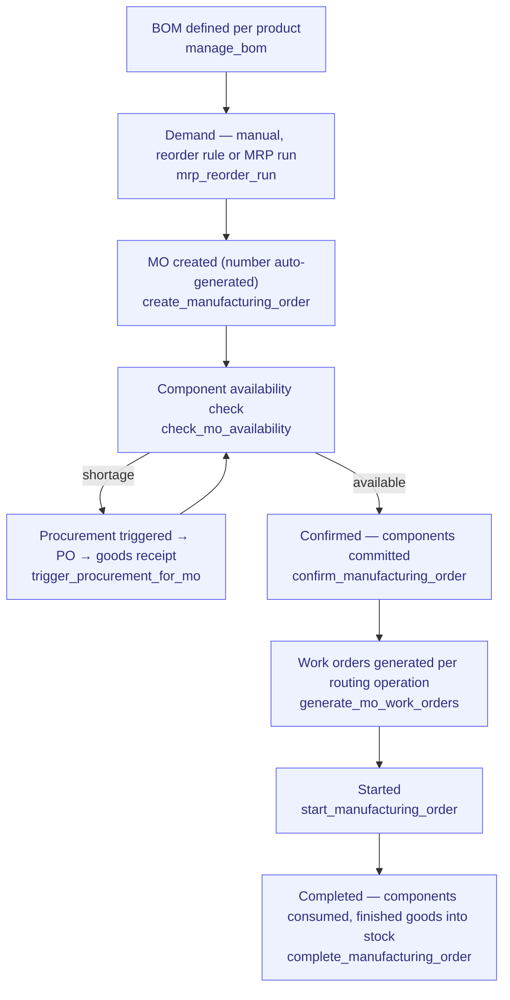

# Plan-to-Produce

> From "we need to make more" to finished goods on the shelf: BOM → availability
> check → manufacturing order → work orders → complete → finished-goods stock.
> The making mirror of Order-to-Delivery.

**Problem it solves:** What a product is made of lives in someone's head, nobody knows if components suffice before starting, and finished quantities never match the stock system — this process gives every product a bill of materials, checks component availability before committing, and posts component consumption + finished goods to inventory automatically.

**Maturity level:** L3 — Operational (agent path verified E2E; shop-floor UI is the gap)
**Status:** ✅ PO → goods receipt → MO → confirm → start → complete → finished-goods stock validated live, uncoached, by an external operator (2026-06)

---

## Modules involved

| Module | Role in the process |
|--------|---------------------|
| **Manufacturing** | BOMs, manufacturing orders, work centers, routing operations, work orders |
| **Products** | The finished good + component catalog (UoM per product) |
| **Inventory** | Component reservation/consumption, finished-goods receipt, valuation layers |
| **Purchasing** | Procurement of missing components (`trigger_procurement_for_mo`, `mrp_reorder_run`) |

---

## Step-by-step flow

*🟦 = agent-runnable step (see Agent coverage below)*

---

## Participating modules & skills

| Step | Module | Skills |
|---|---|---|
| Define | manufacturing | `manage_bom` (components + qty per unit), `manage_work_center`, `manage_routing_operation` |
| Plan | manufacturing + purchasing | `mrp_reorder_run`, `trigger_procurement_for_mo` |
| Order | manufacturing | `create_manufacturing_order`, `list_manufacturing_orders`, `check_mo_availability` |
| Execute | manufacturing | `confirm_manufacturing_order` → `generate_mo_work_orders` → `start_manufacturing_order` → `complete_manufacturing_order` (`cancel_manufacturing_order` exits) |
| Stock effects | inventory | completion consumes components and receives finished goods into valuation layers |

---

## Agent coverage

| Actor | What they run |
|---|---|
| 👤 Manual | Manufacturing admin (BOMs, MO list/detail) |
| 🤖 FlowPilot | MRP reorder runs, availability checks, MO lifecycle |
| 🔗 External agent | full loop over MCP — the whole PO → GR → MO → complete → stock chain was run uncoached by OpenClaw |

---

## Known gaps (parity scorecards)

- ❌ **Shop-floor UI** — work orders exist as data (`generate_mo_work_orders`) but there is no operator screen for start/pause/done per operation (the dual-surface gap keeping several capabilities partial; see `docs/parity/capabilities/manufacturing.json`)
- ❌ Backorder/partial MO completion (produce 80 of 100, keep the rest open)
- ❌ Scrap reporting + quality checks (Odoo Quality)
- ❌ By-products / co-products on the BOM
- ❌ Subcontracted manufacturing
- ⚠️ UoM on BOM lines — components consume in the product's unit; per-line purchase-vs-consume UoM conversion is tracked under products#uom depth

---

## Webhook events

(None dedicated yet — candidates: `mo.created`, `mo.completed`, `stock.produced`)

---

## Best for

Light-assembly SMBs: craft producers, electronics kitting, food/beverage batch makers — anyone whose "manufacturing" is a BOM and a bench, not a factory line.

## Not for

Multi-level MRP with capacity finite-scheduling, subcontracting chains, or process manufacturing with formulas/yields — that is Odoo MRP/PLM territory.
