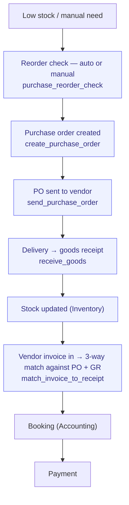

# Procure-to-Pay

> From need identification to paid vendor invoice.

**Problem it solves:** Receipts in a shoebox, vendor invoices matched by hand, and nobody knows what has actually been ordered — this process makes purchases and expenses flow to the ledger without manual bookkeeping.

**Maturity level:** L3 — Operational (3-way match auto-approve live)
**Status:** ✅ Happy path + auto-approve match works; lacks tiered approval thresholds

---

## Modules involved

| Module | Role in the process |
|--------|---------------------|
| **Purchasing** | Vendors, purchase orders, goods receipt |
| **Inventory** | Stock levels, reorder triggers |
| **Expenses** | Employee expense claims (side flow) |
| **Invoicing** | Incoming vendor invoices (AP) |
| **Accounting** | Booking against accounts payable + cost accounts |
| **Documents** | Storage of PO, delivery note, invoice PDF |

---

## Step-by-step flow

*🟦 = agent-runnable step (see Agent coverage below)*

---

## How it works in practice — Expenses (employee reimbursement)

*The adopter lens (see [README](./README.md) § The adopter layer). This is the
canonical home for the expense state machines — module docs link here and
never restate them.*

### The work story

An employee pays for something out of pocket and photographs the receipt in
FlowWink. AI reads it (`analyze_receipt`: amount, VAT, vendor, date, suggested
account) and the expense lands as a **draft** on the right month. At month end,
one action gathers all loose drafts into that month's **expense report**
(`generate_monthly_expense_report` — one report per employee and month, reused
if it exists). The employee submits; the manager approves; booking posts the
journal entry automatically; marking it paid records the actual payout. The
employee never touches a spreadsheet, the accountant never writes the voucher
by hand, and every step is visible as a status.

### State machines

Two coupled entities carry status. The **report** drives the process; each
**expense** follows its report.

**`expense_reports.status`** (one report per employee × month)

| Status | Meaning | Moved forward by | What the transition does |
|---|---|---|---|
| `draft` | Open collection bucket for the month | employee / agent | `generate_monthly_expense_report` attaches loose draft expenses in the period while the report is still draft |
| `submitted` | Sent for approval | employee / agent (`submit_expense_report`) | Locks all included expenses to `submitted` |
| `approved` | Manager signed off | admin / agent (`approve_expense_report`) | Marks all included expenses `approved` |
| `booked` | In the ledger | admin / agent (`book_expense_report`) | Posts the journal entry — **Dt cost account (net) + Dt 2641 input VAT / Cr 2890 owed-to-employee** — and stores `journal_entry_id` on the report |
| `paid` | Employee reimbursed | admin / agent (`mark_expense_report_paid`) | Posts **Dt 2890 / Cr 1930 (bank)** and creates an `expense_payments` row (amount, method, reference, who recorded it) |
| `rejected` | — | ⚠️ in schema, **transition not yet wired** (no function or UI path exists) | — |

**`expenses.status`** (individual receipts) — same value set; individual
expenses are moved by their report's transitions, never independently once
attached. `draft` expenses without a report are "loose" and get collected at
month end.

### Who does what

See the Agent coverage table below — the whole month-end loop
(generate → submit → approve → book → paid) is agent-runnable; approve/book/
paid require admin trust.

### Coming from spreadsheets

- The receipts shoebox/folder → receipt photo + AI extraction at purchase time
- The monthly Excel sheet → the auto-generated monthly report (nothing to build)
- The "OK?" column → the report status (`submitted` → `approved`), visible to both sides
- The accountant's hand-written voucher → `book_expense_report` posts it, balanced, with VAT split
- The "betald?"-note after the bank transfer → `mark_expense_report_paid` records method + reference and settles the liability account

---

## Agent coverage

| Step | 👤 Manual | 🤖 FlowPilot | 🔗 External agent |
|------|----------|-------------|-------------------|
| Vendor onboarding | ✅ | ✅ (`manage_vendor`) | — |
| Reorder detection | — | ✅ (`purchase_reorder_check`) | — |
| PO creation | ✅ | ✅ (`create_purchase_order`) | — |
| PO dispatch | ✅ | ✅ (`send_purchase_order`) | — |
| Goods receipt | ✅ | ✅ (`receive_goods`) | — |
| Expense handling | ✅ | ✅ (`manage_expenses`, `analyze_receipt`) | — |
| 3-way match | ⚠️ Manual fallback | ✅ (`match_invoice_to_receipt`, `auto_approve_vendor_invoice`) | 🔗 Delegation possible |
| Expense P2P loop | ✅ | ✅ (`submit_/approve_/book_/mark_expense_report_paid`) | — |

---

## Known gaps (missing for L5)

- ✅ **3-way match auto-approve** — `match_invoice_to_receipt` + `auto_approve_vendor_invoice` live; tolerance config still manual
- ❌ Multi-step approval based on amount thresholds
- ❌ Vendor portal (vendor self-service login)
- ❌ EDI integration for large suppliers
- ❌ Multi-currency vendor invoices

---

## Webhook events

`purchase_order.created`, `purchase_order.received`, `stock.low`, `stock.adjusted`, `expense.submitted`, `expense.status_changed`

---

## Best for

SMBs with physical inventory or recurring purchasing. Consultancies for expense handling.

## Not for

Manufacturing with complex BOM/MRP, or groups with multi-entity intercompany flows.
