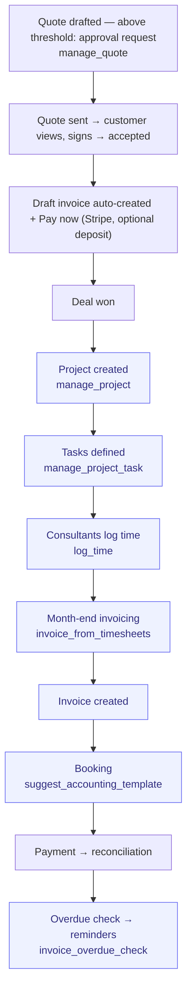

# Quote-to-Cash

> From won deal to paid invoice. The bread and butter of consultancies.

**Problem it solves:** The offer is a PDF, the acceptance is an email, the invoice is re-typed by hand, and payment status is "check the bank account" — this process carries one set of data from signed quote to money in the bank, with reminders that send themselves.

**Maturity level:** L3 — Operational (parts L4)
**Status:** ✅ Works end-to-end for service businesses

---

## Modules involved

| Module | Role in the process |
|--------|---------------------|
| **Quotes** | Pre-deal offers / proposals — convert to deal on accept |
| **Deals** | Source — a won deal triggers project start |
| **Projects** | Projects + tasks (Kanban) |
| **Timesheets** | Time logging against projects/tasks |
| **Invoicing** | Invoice generation from timesheets |
| **Accounting** | Booking invoices against the chart of accounts (BAS 2024) + period lock |
| **Reconciliation** | Stripe payouts + bank file matching against AR |
| **Contracts** | Underlying agreements that govern price/terms |

---

## Step-by-step flow

*🟦 = agent-runnable step (see Agent coverage below)*

---

## How it works in practice — sign-and-pay (offer to money in the bank)

*The adopter lens (see [README](./README.md) § The adopter layer). This is the
canonical home for the quote and invoice state machines — module docs link
here and never restate them.*

### The work story

An admin (or the agent) drafts a quote: line items, a validity date, optionally
a prepayment percentage. Above the approval threshold it first goes to a
manager for sign-off. Sending mints a personal link and emails the customer.
The customer opens the link (the quote flips to *viewed*), reads the offer, and
signs — by drawing a signature or typing their name. Acceptance is stored with
tamper evidence (signer, IP, a hash of exactly what was signed) on a printable
certificate, and a draft invoice is created from the quote lines in the same
moment. The page then offers **Pay now**: Stripe Checkout for the full amount —
or only the deposit share if a prepayment percentage was set. The webhook
records the payment against the invoice; when the running total reaches the
invoice total, the invoice flips to *paid*. Nobody re-typed anything between
"yes" and the money arriving.

### State machines

**`quotes.status`**

| Status | Meaning | Moved forward by | What the transition does |
|---|---|---|---|
| `draft` | Being built | admin / agent | Line-item changes recalculate totals automatically |
| `pending_approval` | Above threshold, awaiting sign-off | admin / agent (request approval) | Creates an `approval_requests` row and links it; sending is blocked while pending. Resolving the request does not auto-flip the quote — an admin proceeds once approved |
| `sent` | Customer has the link | admin / agent (send) | Mints the public accept token, stamps `sent_at`, snapshots a version, emails the customer; enters the 6-hourly expiry-reminder sweep (reminds ~48 h before `valid_until`) |
| `viewed` | Customer opened it | customer (opening the public page) | Stamps `viewed_at` and logs a view event |
| `accepted` | Customer signed yes | customer (public signing page) | Records the signature (name, optional drawn image, IP, user agent, SHA-256 content hash), **auto-creates a draft invoice** from the quote lines and links it, emails both sides. "Pay now" becomes available |
| `rejected` | Customer signed no | customer (or admin) | Records the same signature evidence + `rejected_at`; admin can revert to draft |
| `expired` | — | ⚠️ in schema, **no transition writes it** — expiry is enforced instead: signing after `valid_until` is refused (HTTP 410) and the reminder sweep pre-warns | — |
| `cancelled` | — | ⚠️ in schema, **transition not yet wired** | — |

**`invoices.status`** — plus `invoice_type` (`invoice` \| `credit_note`) and
the `paid_amount_cents` running total

| Status | Meaning | Moved forward by | What the transition does |
|---|---|---|---|
| `draft` | Created — from a quote acceptance, timesheets, or a subscription cycle | system / admin / agent | — |
| `sent` | Issued to the customer | admin / agent | Stamps `sent_at`; the invoice is now watched by the overdue sweep |
| `overdue` | Past due date, unpaid | dunning sweep (`send_dunning_reminders`) | Flips `sent` → `overdue` and logs a reminder step by days overdue: <7 d pre-reminder, 7 d friendly, 14 d formal, 30 d final notice |
| `paid` | Fully settled | `record_invoice_payment` — called by the Stripe webhook, reconciliation, or manually | **Each payment ADDS to `paid_amount_cents`** (over-payment rejected); status flips to `paid` only when the total is reached — a prepayment deposit leaves the invoice partially paid and still open. Stamps `paid_at`; a sign-and-pay payment also stamps `paid_at` on the quote |
| `cancelled` | Voided | admin | Payments against a cancelled invoice are refused |

Credit notes: `create_credit_note` issues a negative invoice
(`invoice_type = credit_note`, numbered `CN-{original}-n`, born `sent`) that
negates the original in full or by a given amount. A credit note can be
neither paid nor credited again.

### Who does what

See the Agent coverage table below. Drafting, sending, and converting are
agent-runnable (`manage_quote`); signing and paying belong to the customer on
the public page; approval sign-off requires an admin/approver.

### Coming from spreadsheets

- The offert-PDF attached to an email → a personal signing link with draw/type signature and a certificate
- The "har kunden svarat?" follow-up → live statuses (`sent` → `viewed` → `accepted`) plus automatic expiry reminders
- Re-typing the accepted offer into an invoice → the draft invoice is created at the moment of acceptance
- "Kolla bankkontot" → Pay now + webhook: payments accumulate on the invoice, deposit and remaining balance always visible
- The påminnelse-mail you kept forgetting → the overdue sweep escalates by itself (friendly → formal → final notice)

---

## Agent coverage

| Step | 👤 Manual | 🤖 FlowPilot | 🔗 External agent |
|------|----------|-------------|-------------------|
| Project setup | ✅ | ✅ (`manage_project`) | — |
| Task management | ✅ | ✅ (`manage_project_task`) | — |
| Time logging | ✅ | ✅ (`log_time`) | — |
| Invoice from time | ✅ | ✅ (`invoice_from_timesheets`) | — |
| Booking suggestion | — | ✅ (`suggest_accounting_template`) | — |
| Overdue reminders | ✅ | ✅ (`invoice_overdue_check`, automation) | — |
| Reconciliation | ✅ | ⚠️ Partial | — |

---

## Known gaps (missing for L5)

- ✅ Quote/proposal module — full sign-and-pay flow live (e-sign with certificate, auto-invoice on accept, Stripe Pay now, `prepayment_pct` deposits); deal-conversion automation still WIP
- ✅ Versioned price lists — `pricelists` module: customer/company price lists with validity windows; `resolve_pricelist_price` picks the most specific match
- ⚠️ Recurring billing — `subscriptions` module covers MRR/dunning; Stripe is primary processor
- ✅ Multi-currency at the invoice level — `multi-currency` module; invoices and quotes carry `exchange_rate`, rates via `fetch-fx-rates`
- ✅ Amount-threshold approvals — generic `approvals` engine (rules per entity type incl. invoice and quote); the quote flow is wired end-to-end via the `pending_approval` status, invoice rules are configured in the Approvals UI
- ⚠️ Reconciliation requires manual matching for ambiguous cases (auto via `auto_match_transactions`)

---

## Webhook events

`deal.won`, `project.created`, `task.completed`, `timesheet.submitted`, `invoice.created`, `invoice.paid`, `invoice.overdue`

---

## Best for

Consulting firms, agencies, freelancer teams billing hourly or fixed-price per project.

## Not for

Pure SaaS with MRR focus (use Stripe subscriptions directly), or manufacturers with complex project costing.
