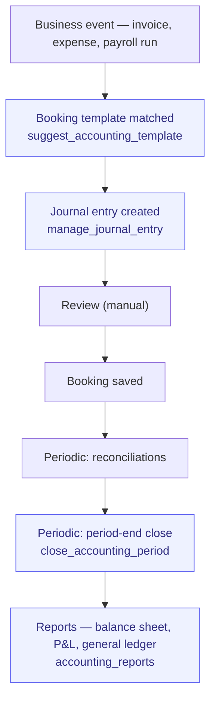

# Record-to-Report

> From transaction to financial report. Bookkeeping + period-end close.

**Problem it solves:** The books live with an external accountant and the owner learns the numbers months later — this process keeps double-entry bookkeeping, reconciliation and reports in-house and current, with balanced vouchers posted automatically.

**Maturity level:** L3 — Operational (period lock + reconciliation live)
**Status:** ✅ Double-entry bookkeeping, period lock, bank file/image OCR import; ⚠️ no tax filings

---

## Modules involved

| Module | Role in the process |
|--------|---------------------|
| **Accounting** | Chart of accounts (BAS 2024 / IFRS / US GAAP via locale packs), journal entries, templates, period lock, export adapters (SIE 4 / SAF-T) |
| **Reconciliation** | Stripe payouts sync, bank file/image (OCR) import, auto-matching |
| **Invoicing** | Source for AR bookings |
| **Expenses** | Source for AP / expense bookings (auto-booked on approval) |
| **Analytics** | Financial KPI reports |
| **Documents** | Voucher / supporting document archive |

---

## Step-by-step flow



*🟦 = agent-runnable step (see Agent coverage below)*

---

## Agent coverage

| Step | 👤 Manual | 🤖 FlowPilot | 🔗 External agent |
|------|----------|-------------|-------------------|
| Chart of accounts setup | ✅ | ✅ (`manage_chart_of_accounts`) | — |
| Template management | ✅ | ✅ (`manage_accounting_template`) | — |
| Booking suggestion | — | ✅ (`suggest_accounting_template`) | — |
| Journal entries | ✅ | ✅ (`manage_journal_entry`) | — |
| Opening balances | ✅ | ✅ (`manage_opening_balances`) | — |
| Reconciliations | ✅ | ⚠️ Partial (autonomous reconciliation) | — |
| Reports | ✅ | ✅ (`accounting_reports`) | — |
| Period-end close | ✅ | ✅ (`close_accounting_period`, `reopen_accounting_period`) | — |
| Tax reporting | ❌ Missing | — | — |

---

## Known gaps (missing for L4+)

- ✅ **Period-end close workflow** — `close_accounting_period` locks JE + JE-lines + time_entries via guard triggers
- ❌ Tax reporting (VAT, employer reports, K10)
- ✅ SIE export — pluggable adapters per locale pack (SE → SIE 4, generic → SAF-T + CSV)
- ✅ Bank feed / reconciliation — `import_bank_file`, `import_bank_image` (OCR), `sync_stripe_payouts`, `auto_match_transactions`
- ❌ Multi-currency revaluation
- ⚠️ Cost center / project-level — `manage_analytic_account` + `tag_journal_entry_analytics` exist; reporting limited
- ❌ Consolidation (multi-entity)

---

## Period close & lock

When `close_accounting_period(year, month)` is called (skill `close_accounting_period`, or via `lock_timesheet_period`):

| Table | Guard trigger | Effect |
|-------|---------------|--------|
| `journal_entries` | `guard_journal_entries_period` | Insert/update/delete blocked for entry_date in closed period |
| `journal_entry_lines` | `guard_journal_entry_lines_period` | Same, propagated through parent entry |
| `time_entries` | `guard_time_entries_period` ✨ | Insert/update/delete blocked — protects payroll & invoicing cutoffs |

Reopen via `reopen_accounting_period(year, month)` (admin only). Periods in `locked` state cannot be reopened.

---

## Webhook events

`invoice.created`, `invoice.paid`, `expense.status_changed`

---

## Best for

Smaller companies that want internal visibility into their finances, complementing an external accountant for filings.

## Not for

Companies looking to fully replace Fortnox/Visma — we are not a complete accounting system yet. Position us as "operational finance" rather than "filings".

---

## Neutral-core safety primitives (locale-agnostic)

Three universal primitives sit above the per-pack bookkeeping logic and apply equally to SE/IFRS/DE/UK/US:

### 1. Staged-Operation Envelope

Every high-risk ledger-mutating skill (`manage_journal_entry`, `book_expense_report`, `mark_expense_report_paid`, `record_pos_sale_v2`, `close_pos_session_v2`, `close_accounting_period`, `reopen_accounting_period`) is flagged `requires_staging=true`. MCP callers receive a **preview envelope** with `risk_level`, `period_status`, and the payload that *would* be written, plus a pointer to `approve_pending_operation` / `reject_pending_operation`. Nothing reaches the ledger until an operator (human or peer) approves.

Flow:
```
peer → manage_journal_entry(args)
  ← 202 { staged:true, pending_id, preview, next:{approve,reject} }
operator → approve_pending_operation(pending_id)
peer → manage_journal_entry(args, _approved_operation_id=pending_id)
  ← 200 { entry_id, voucher_number, ... }
```

See `mem://accounting/staged-operations-envelope`.

### 2. Voucher integrity

`assign_voucher_number` trigger guarantees sequential `(series, year)` numbering on every `journal_entries` insert. `list_voucher_gaps` + `explain_voucher_gap` (both MCP skills) let auditors and FlowPilot detect and explain any break — universal requirement across BAS, HGB/SKR, IFRS, US GAAP.

### 3. Year-end orchestration

`year_end_readiness(year)` runs a 6-point checklist before any close. `propose_accruals(year)` and `propose_annual_depreciation(year)` produce stagable proposals. `run_year_end(year, confirm)` is the orchestrator. Country-specific extras (SE periodiseringsfond, DE Rückstellungen, US deferred tax) plug in via `pack.year_end_proposals?(year)` — core stays neutral.

See `mem://accounting/year-end-readiness`.
