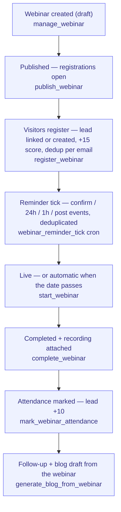

# Register-to-Attend

> The event/webinar loop: publish → register → remind → run → mark attendance →
> follow up. Every registration is a scored lead; every completed webinar can
> become content.

**Problem it solves:** Event signups sit in a form export that never reaches the CRM — this process turns every registration into a scored lead, reminds attendees automatically, and closes the loop from webinar to follow-up to content.

**Maturity level:** L3 — Operational (lifecycle + lead-loop live; reminders/follow-up are event-emission only)
**Status:** ✅ Core loop live · webinars scores 78% parity (5th highest module)

---

## Modules involved

| Module | Role in the process |
|--------|---------------------|
| **Webinars** | Webinar lifecycle, registrations, attendance, reminder tick |
| **CRM (Leads)** | Registration auto-links or creates a lead (`source=webinar`, +15 score; +10 on attendance) |
| **Blog** | Content loop — `generate_blog_from_webinar` drafts a post from a completed webinar |
| **Automations** | Consumers of the `webinar.*` platform events (reminders, cancellation notices, follow-up) |

---

## Step-by-step flow

*🟦 = agent-runnable step (see Agent coverage below)*

`cancel_webinar` exits the flow from any non-terminal status and emits
`webinar.cancelled` so automations can notify registrants.

---

## How it works in practice

*The adopter lens (see [README](./README.md) § The adopter layer). This is the
canonical home for the webinar state machines — module docs link here and
never restate them.*

### The work story

Marketing drafts a webinar (title, date, platform, meeting link) — it sits in
**draft**, invisible. Publishing flips it to **published**: the public block
shows it and registrations open. Each registration is more than a name on a
list — the RPC looks up the email among existing leads, links it or creates a
new lead with `source=webinar` and +15 score, so sales sees warm interest the
moment someone signs up. Every 15 minutes a reminder tick emits confirm /
24-hour / 1-hour / post-event platform events per registration, each stamped
so it never fires twice. On the day, the host flips the webinar **live**, runs
the session, then **completes** it — attaching the recording URL. Afterwards,
attendance is marked per registration: attendees get another +10 lead score,
so the follow-up list is already ranked. Finally the completed webinar can be
turned into a draft blog post — the content loop closes.

### State machines

Two entities carry state: the **webinar** drives the lifecycle; each
**registration** carries per-person flags.

**`webinars.status`** (CHECK constraint: `draft / published / live /
completed / cancelled`)

| Status | Meaning | Moved forward by | What the transition does |
|---|---|---|---|
| `draft` | Being planned, not visible | admin / agent (`manage_webinar` create) | Row created; registrations rejected |
| `published` | Open for registration | admin / agent (`publish_webinar`, from `draft` only) | Emits `webinar.published`; `register_for_webinar` now accepts signups |
| `live` | Broadcast running | admin / agent (`start_webinar`, from `draft` or `published`) — normally automatic when the date passes | Emits `webinar.live`; registrations still accepted |
| `completed` | Ran and closed | admin / agent (`complete_webinar`, from `live` or `published`) | Sets `recording_url` (if passed), emits `webinar.completed`; unlocks `generate_blog_from_webinar` |
| `cancelled` | Will not run | admin / agent (`cancel_webinar`, from anything except `completed`/`cancelled`; trust: approve) | Emits `webinar.cancelled` with reason so automations can notify registrants |

**`webinar_registrations`** — no status column; per-registration flags:

| Field | Meaning | Moved forward by | What the transition does |
|---|---|---|---|
| (created) | Person is registered | visitor (WebinarBlock) / agent (`register_webinar`) | Lead auto-linked by email or created (`source=webinar`, +15 score); upsert on `(webinar_id, email)` — re-registering never duplicates; emits `webinar.registered` |
| `attended` | Showed up (default false) | admin / agent (`mark_webinar_attendance`) | On `attended=true` with a linked lead: +10 lead score; emits `webinar.attended` |
| `reminder_confirm/t24/t1/post_sent_at` | Reminder markers | `webinar_reminder_tick()` cron (every 15 min) | Emits `webinar.reminder.{confirm,t24,t1,post}` platform events, one per registration per stage — **event emission only; an automation rule must send the actual email** |
| `follow_up_sent` | Follow-up done (default false) | ⚠️ flag in schema + admin badge; **no send skill or transition wired** | — |

### Who does what

See the Agent coverage table below — the full lifecycle (publish → start →
complete → attendance) is agent-runnable with notify-level trust
(`cancel_webinar` requires approval); registration is external-scope, so
visitors, chat and MCP operators all use the same RPC.

### Coming from spreadsheets

- The signup Google Form + export → `register_for_webinar` with built-in dedup per event
- The copy-paste into the CRM afterwards → automatic: every registration is a linked, scored lead at signup time
- The manual "reminder tomorrow!" email → `webinar.reminder.*` events on a 15-minute tick, deduplicated per registration
- The attendance checklist → `mark_webinar_attendance`, which also ranks your follow-up list via lead score
- The "write a recap post someday" note → `generate_blog_from_webinar` drafts it from the completed webinar

---

## Agent coverage

| Step | 👤 Manual | 🤖 FlowPilot | 🔗 External agent |
|------|----------|-------------|-------------------|
| Create / edit | ✅ (WebinarsPage) | ✅ (`manage_webinar`) | ✅ |
| Publish | ✅ | ✅ (`publish_webinar`, trust: notify) | ✅ |
| Register | ✅ (public WebinarBlock) | ✅ (`register_webinar`, external scope) | ✅ |
| Reminders | — | auto (`webinar_reminder_tick` cron → platform events) | — |
| Start / complete | ✅ | ✅ (`start_webinar`, `complete_webinar` + recording URL) | ✅ |
| Cancel | ✅ | ✅ (`cancel_webinar`, trust: approve) | ✅ (staged) |
| Attendance | ✅ | ✅ (`mark_webinar_attendance`, trust: auto) | ✅ |
| Content loop | — | ✅ (`generate_blog_from_webinar` → blog draft, never auto-publishes) | ✅ |

---

## Known gaps (missing for L4/L5)

- ⚠️ Reminders are **event emission only** — `webinar.reminder.*` fires on the
  cron tick, but no built-in email template/automation ships; a rule must be
  wired per instance (scorecard: partial)
- ⚠️ Follow-up: `follow_up_sent` flag + admin badge exist, but no send skill —
  the transition is not wired (scorecard: partial)
- ❌ Paid tickets (no price/ticket fields in the schema)
- ❌ Multi-session events, tracks, physical-event features (Odoo Events breadth)

---

## Webhook events

Platform events (consumed by the automations pipeline): `webinar.published`,
`webinar.live`, `webinar.completed`, `webinar.cancelled`, `webinar.registered`,
`webinar.attended`, `webinar.reminder.confirm`, `webinar.reminder.t24`,
`webinar.reminder.t1`, `webinar.reminder.post`

---

## Best for

SMBs running webinars or online events as a lead channel — the
register → score → attend → score → follow-up loop lands leads in the CRM
without any exports.

## Not for

Paid/ticketed events, multi-track conferences, or physical event logistics
(badges, venues, sessions).
