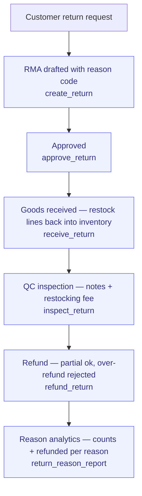

# Return-to-Refund

> The reverse-logistics mirror of Order-to-Delivery: request → approve → receive →
> inspect → restock → refund.

**Problem it solves:** Returns are handled ad hoc — nobody knows what came back, restocking is guesswork, and refund amounts are worked out on a pocket calculator — this process tracks every RMA from request to refund with the math enforced.

**Maturity level:** L3 — Operational (full RMA lifecycle incl. QC + partial refunds)
**Status:** ✅ Core loop live · F2 depth (reasons/fees/partials) shipped 2026-06-12

## Flow

*🟦 = agent-runnable step (see Agent coverage below)*

## Participating modules & skills

| Step | Module | Skills |
|---|---|---|
| Request | returns | `create_return` (reason_code), `manage_return_item` |
| Approve/receive | returns + inventory | `approve_return`, `receive_return` (restock → valuation layers) |
| QC | returns | `inspect_return` (notes + restocking_fee_cents) |
| Refund | returns + invoicing | `refund_return` (partial, Stripe/manual/store_credit) |
| Analyze | returns | `return_reason_report` |

## How it works in practice — the RMA loop

*The adopter lens (see [README](./README.md) § The adopter layer). This is the
canonical home for the RMA state machine — module docs link here and never
restate it.*

### The work story

A customer wants to send something back. Support creates an RMA against the
order with a reason code (defective, wrong item, changed mind, …) — the RMA
number is generated automatically — and adds the lines: quantity, the refund
per unit, and whether the item can go back on the shelf. A manager approves.
When the parcel arrives, receiving it puts every restockable line back into
inventory in one step. QC inspects the goods, writes notes, and — if the box
came back opened — sets a restocking fee. Then the refund: it can be paid out
in parts (say, the undamaged item now, the rest after a Stripe refund clears),
and the system keeps the running total, shows what remains, and refuses to pay
out more than items-minus-fee. When the total is reached the RMA closes
itself; an operator can also close it early below the total.

### State machine

**`returns.status`** (one RMA per return request; free-text column — the
values below are the ones the shipped transitions write)

| Status | Meaning | Moved forward by | What the transition does |
|---|---|---|---|
| `requested` | Customer asked to return | support / agent (`create_return`) | Creates the RMA (number auto-generated) with a reason code; lines added via `manage_return_item` (qty, `unit_refund_cents`, restock flag) |
| `approved` | Green light to ship it back | admin / agent (`approve_return`) | Only from `requested`; stamps who approved and when, appends notes |
| `received` | Goods are back | admin / agent (`receive_return`) | Only from `approved`; stamps `received_at` and **emits a stock movement for every `restock = true` line** — items land back in inventory valuation layers |
| *(inspection)* | QC done | admin / agent (`inspect_return`) | **Not a status change** — only valid while `received`; stamps `inspected_at`, notes, and sets `restocking_fee_cents` (deducted from the expected refund) |
| `refunded` | Money returned, RMA closed | admin / agent (`refund_return`) | Allowed from `received` or `approved`. **Each call ADDS `refund_cents` to the running total**; expected total = Σ(line qty × `unit_refund_cents`) − restocking fee; over-refund is rejected. Status flips to `refunded` when the total is reached **or** the caller passes `p_final: true` (close below total). Records method (stripe / manual / store_credit) |
| `rejected` / `cancelled` | — | ⚠️ recognized by the admin UI, but **no transition writes them yet** | — |

### Who does what

See the Agent coverage table below — the full loop (create → approve →
receive → inspect → refund) runs manually in ReturnsPage and end-to-end over
MCP; inspection and refunds require admin trust.

### Coming from spreadsheets

- The "returer"-flik with free-text reasons → reason codes that `return_reason_report` can actually aggregate
- The warehouse post-it "kan säljas igen?" → the restock flag per line; receiving posts the stock movement for you
- The calculator session "hur mycket ska tillbaka?" → the system computes items − restocking fee and blocks over-refunds
- The "har vi betalat tillbaka?" column → running refunded/remaining on the RMA; it closes itself at the total

## Agent coverage

| Actor | What they run |
|---|---|
| 👤 Manual | ReturnsPage (create w/ reason, Inspect step, partial refund w/ remaining, reasons widget) |
| 🤖 FlowPilot | reason analytics in reviews; refund execution on approval |
| 🔗 External agent | full loop over MCP |

## Known gaps (parity scorecards)

`return_to_vendor`, `return_email`/labels, `reverse_logistics` pickup,
`condition_actions` — see `docs/parity/capabilities/returns.json`.
