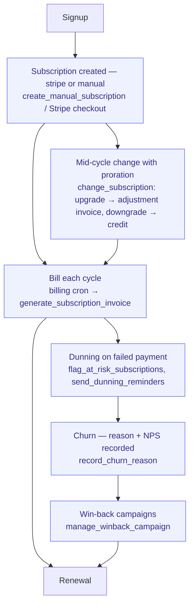

# Subscribe-to-Renew

> From signup to recurring revenue: bill on cycle, handle changes with proration,
> chase failures, win back churn. The recurring-revenue mirror of Quote-to-Cash.

**Problem it solves:** Recurring revenue leaks silently — invoice dates in an Excel, failed cards nobody chases, churn nobody explains — this process bills every cycle on time, escalates failed payments by itself, and records why customers leave.

**Maturity level:** L3 — Operational (manual/invoice-billed subs end-to-end; card subs via Stripe webhooks)
**Status:** ✅ Core loop live · proration shipped 2026-06-12

## Flow

*🟦 = agent-runnable step (see Agent coverage below)*

## Participating modules & skills

| Step | Module | Skills / functions |
|---|---|---|
| Create | subscriptions | `create_manual_subscription` (B2B invoice-billed), Stripe webhooks (card) |
| Bill on cycle | subscriptions + invoicing | `subscription-billing-cron` → `generate_subscription_invoice` |
| Mid-cycle change | subscriptions | `change_subscription` — prorated by remaining days; upgrade → draft adjustment invoice, downgrade → credit on `metadata.last_change` |
| Collect | invoicing + reconciliation | `send_dunning_reminders`, `auto_mark_invoice_paid` |
| Risk & churn | subscriptions | `flag_at_risk_subscriptions`, `record_churn_reason`, `upcoming_renewals` |
| Win back | subscriptions | `manage_winback_campaign`, `list_winback_campaigns` (offer + email per churn segment) |
| Report | subscriptions | `subscription_mrr` (MRR/ARR/churn) |

## How it works in practice — the recurring loop

*The adopter lens (see [README](./README.md) § The adopter layer). This is the
canonical home for the subscription and dunning state machines — module docs
link here and never restate them.*

### The work story

A B2B customer signs a monthly plan billed by invoice. The admin (or agent)
creates the subscription once — price, quantity, payment terms, start date —
and never thinks about invoice dates again: a daily cron finds every active
manual subscription whose next invoice date has arrived and generates the
cycle invoice (as a draft for review, or issued directly if the subscription
is set to auto-finalize), then advances the period and the next invoice date.
Mid-cycle the customer adds two seats: one call computes the remaining-days
fraction and issues a prorated adjustment invoice; a downgrade instead records
a credit to apply next cycle. Card-billed subscriptions live in Stripe — when
a charge fails, a dunning ladder opens automatically and escalates over two
weeks until the payment recovers or the subscription is cancelled. When a
customer does churn, the reason (and NPS) is recorded, and a win-back campaign
holds the offer to bring them back.

### State machines

**`subscriptions.status`**

| Status | Meaning | Moved forward by | What the transition does |
|---|---|---|---|
| `active` | Billing on cycle | admin / agent (`create_manual_subscription`) or Stripe checkout | Manual create sets price, terms, and `next_invoice_date`. Each cycle the billing cron calls `generate_subscription_invoice`: creates the `SUB-…` invoice (draft, or `sent` when `auto_finalize`), advances the period + `next_invoice_date`. `change_subscription` (active only): upgrade → prorated draft adjustment invoice (`SUB-ADJ-…`), downgrade → credit recorded on the subscription for next cycle |
| `canceled` | Terminated | admin (`cancel_manual_subscription`) or Stripe | Stamps `canceled_at`/`ended_at`, clears `next_invoice_date` (no more cycle invoices), emits a churn event — the moment to `record_churn_reason` |
| `trialing`, `past_due`, `paused`, `unpaid`, `incomplete`, `incomplete_expired` | Card-subscription states | Stripe webhooks (mirrored) | No local transition writes these for manual subscriptions; `past_due`/low health flips `at_risk = true` via the `flag_at_risk_subscriptions` sweep |

**`dunning_sequences.status`** (card subscriptions; one ladder per failed payment)

| Status | Meaning | Moved forward by | What the transition does |
|---|---|---|---|
| `active` | Chasing a failed charge | Stripe webhook on `invoice.payment_failed` | Opens (or restarts) the ladder with MRR-at-risk computed; the cron then walks the steps: **day 0** gentle notice, **day 3** reminder, **day 7** urgent, **day 10** final + a CRM task for a human when ≥ 500/month is at risk, **day 14** cancel in Stripe |
| `recovered` | Customer paid | Stripe webhook on payment success (or the cron seeing the sub active again) | Stops the ladder, stamps `recovered_at` |
| `failed` | Ladder exhausted | dunning cron | Day-14 step cancels the subscription in Stripe and closes the sequence |
| `paused` / `cancelled` | — | ⚠️ in schema, **transition not yet wired** | — |

Invoice-billed subscriptions are chased on the invoice instead:
`send_dunning_reminders` flips overdue cycle invoices `sent` → `overdue` and
escalates by days overdue (see Quote-to-Cash § invoice state machine).

Win-back: campaigns (offer type, discount, email) are managed via
`manage_winback_campaign` with an `active` flag; the per-customer send log
(`subscription_winback_sends`: queued → sent → opened → converted) is
⚠️ in schema, send-tracking not yet wired to a writer — outreach itself runs
through the operator's email skills.

### Who does what

See the Agent coverage table below — creation, cycle billing, proration,
at-risk sweeps and reporting are agent-runnable; cancelling a manual
subscription and reviewing draft cycle invoices require an admin.

### Coming from spreadsheets

- The renewals-Excel with hand-maintained invoice dates → `next_invoice_date` + the daily billing cron (nothing to remember)
- The "ring kunder som inte betalat"-list → the dunning ladder, with an automatic CRM task at day 10 for high-value accounts
- The proration math in a pocket calculator → `change_subscription` computes the remaining-days fraction and issues the adjustment for you
- The churn-lista with a "varför?"-column → `record_churn_reason` (+NPS) feeding win-back campaigns
- The MRR tab someone rebuilt every quarter → `subscription_mrr`, always current

## Agent coverage

| Actor | What they run |
|---|---|
| 👤 Manual | Subscriptions admin UI, invoice review |
| 🤖 FlowPilot | billing cron, dunning, at-risk sweeps, renewal outreach |
| 🔗 External agent | full loop over MCP (create/change/report skills) |

## Known gaps (tracked in parity scorecards)

- `subscriptions.proration` — engine shipped + Stage-3-verified; admin UI for
  qty/price change pending (→ done after UI).
- `invoicing.recurring` — recurring engine exists for subscription-billed
  invoices; standalone recurring invoices (no subscription) not yet.
- Usage-based billing, plan templates, cohort analysis — see
  `docs/parity/capabilities/subscriptions.json`.
