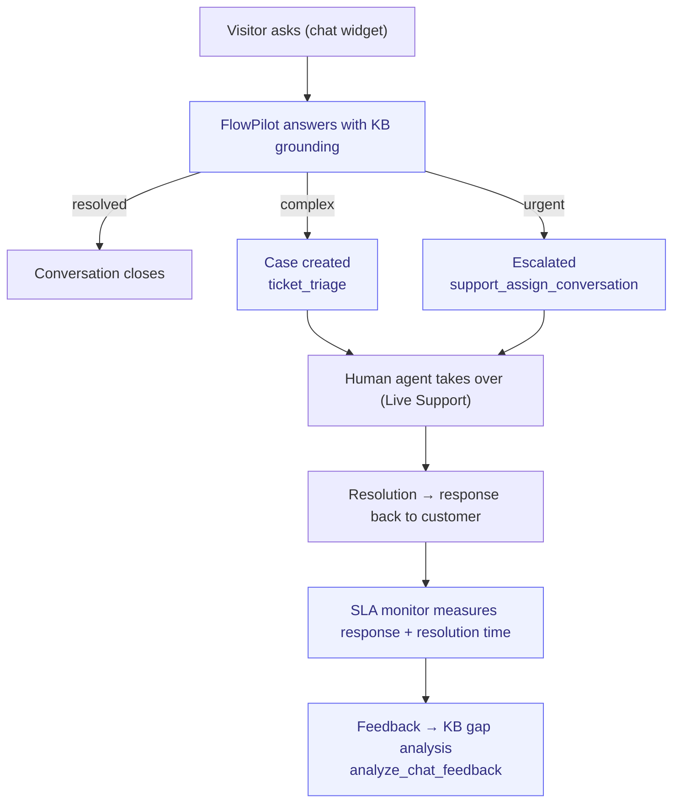

# Support-to-Resolution

> From customer question to resolved case. Self-service + human handoff.

**Problem it solves:** The same questions arrive over and over, answers depend on who happens to reply, and urgent cases drown in the inbox — this process answers instantly from the knowledge base and escalates only what truly needs a human.

**Maturity level:** L3 — Operational
**Status:** ✅ AI Chat + KB + ticketing work; SLA monitor warns on escalation

---

## Modules involved

| Module | Role in the process |
|--------|---------------------|
| **AI Chat** | Frontline — the agent answers visitors directly |
| **Knowledge Base** | Source for agent answers, self-service portal |
| **Tickets** | Structured cases for complex issues |
| **Live Support** | Handoff to a human agent |
| **SLA** | Monitors response/resolution times, escalates on delay |

---

## Step-by-step flow

*🟦 = agent-runnable step (see Agent coverage below)*

---

## Agent coverage

| Step | 👤 Manual | 🤖 FlowPilot | 🔗 External agent |
|------|----------|-------------|-------------------|
| Frontline answers | — | ✅ (chat-completion) | — |
| KB lookup | ✅ | ✅ (KB embedded in context) | — |
| Ticket triage | ✅ | ✅ (`ticket_triage`) | — |
| Conversation assignment | ✅ | ✅ (`support_assign_conversation`) | — |
| Human response | ✅ | — | — |
| SLA escalation | — | ✅ (SLA monitor automation) | — |
| Feedback analysis | — | ✅ (`analyze_chat_feedback`, `support_get_feedback`) | — |
| KB gap → new article | ✅ | ✅ (`kb_gap_analysis` + `manage_kb_article`) | — |

---

## Known gaps (missing for L5)

- ❌ Multi-channel inbox (email, WhatsApp, Slack in one view)
- ❌ Customer satisfaction (CSAT) surveys after a case
- ❌ Macros / canned responses for human agents
- ❌ Skill-based routing to specific agents
- ❌ Internal knowledge base (separate from public KB)

---

## Webhook events

(None dedicated yet — could be extended with `ticket.created`, `ticket.resolved`)

---

## Best for

SMBs with inbound support questions where 60–80% can be resolved via self-service / AI. Consultancies, early-stage SaaS.

## Not for

High-volume call centers, or B2B enterprises with dedicated Customer Success Managers per account.
